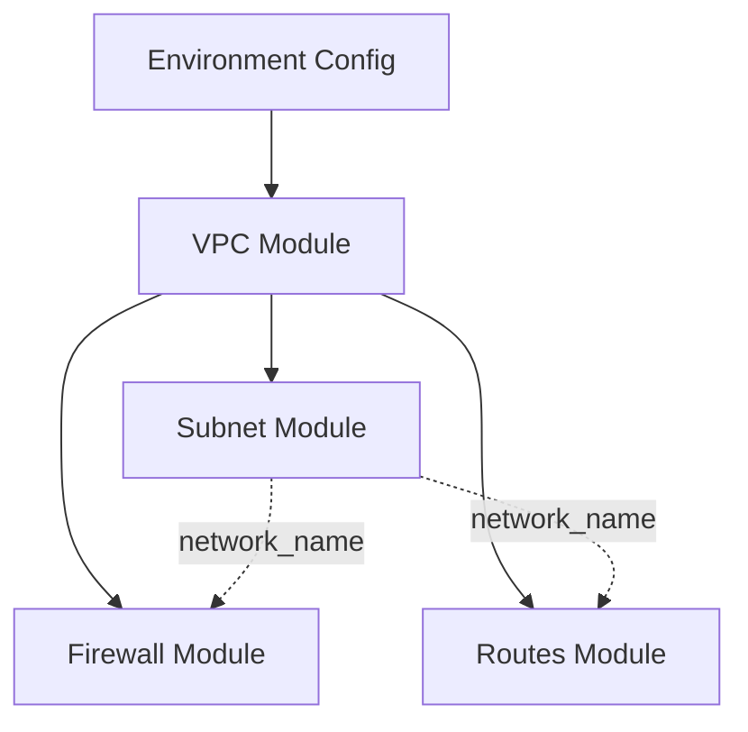

# Design Document

## Overview

This design document describes a modular Terraform infrastructure-as-code solution for managing GCP networking resources. The system uses a module-based architecture where reusable networking components (VPC, subnets, firewall rules, routes) are defined once and instantiated multiple times across different environments (dev, prod) with varying configurations.

The design emphasizes:
- **Modularity**: Each network component is encapsulated in its own module with clear inputs/outputs
- **Reusability**: Modules accept parameterized inputs via maps and lists, enabling flexible configuration
- **Environment Isolation**: Separate state and configuration per environment while sharing module code
- **Local-First Development**: Designed for local Terraform CLI workflows with future CI/CD extensibility

## Architecture

### High-Level Structure

```
network-as-code-gcp/
├── modules/              # Reusable Terraform modules
│   ├── vpc/             # VPC network creation
│   ├── subnet/          # Subnet management (multi-region)
│   ├── firewall/        # Firewall rule management
│   └── routes/          # Custom route management
└── environments/         # Environment-specific configurations
    ├── dev/             # Development environment
    └── prod/            # Production environment
```

### Module Dependency Flow



The VPC module must be created first, as its outputs (network_name, network_self_link) are required by the subnet, firewall, and routes modules. Terraform's implicit dependency graph will handle this ordering when modules reference outputs from other modules.

### Authentication & Provider Configuration

Each environment directory contains its own `providers.tf` that configures:
- Google provider version constraints (~> 5.0)
- Project, region, and zone variables
- Authentication via `GOOGLE_APPLICATION_CREDENTIALS` environment variable pointing to a service account key JSON file

### State Management

Initially, Terraform state will be stored locally (default behavior). Each environment's `backend.tf` contains a commented GCS backend configuration template that users can activate after creating a GCS bucket:

```hcl
# terraform {
#   backend "gcs" {
#     bucket = "REPLACE_ME_TF_STATE_BUCKET"
#     prefix = "network-as-code/dev"  # or "network-as-code/prod"
#   }
# }
```

## Components and Interfaces

### 1. VPC Module (`modules/vpc`)

**Purpose**: Creates a custom-mode VPC network in GCP.

**Inputs**:
- `project_id` (string, required): GCP project ID
- `network_name` (string, required): Name for the VPC network
- `routing_mode` (string, optional, default="GLOBAL"): Routing mode (GLOBAL or REGIONAL)
- `auto_create_subnetworks` (bool, optional, default=false): Whether to auto-create subnets

**Resources**:
- `google_compute_network`: Creates the VPC with custom mode (no auto-created subnets)

**Outputs**:
- `network_self_link` (string): Full self-link URL of the created network
- `network_name` (string): Name of the created network

**Implementation Notes**:
- Always sets `auto_create_subnetworks = false` to enforce explicit subnet management
- Uses `delete_default_routes_on_create = false` to preserve default internet route

### 2. Subnet Module (`modules/subnet`)

**Purpose**: Creates multiple subnets across different regions within a VPC using a single module invocation.

**Inputs**:
- `project_id` (string, required): GCP project ID
- `network_name` (string, required): Name of the parent VPC network
- `subnets` (map(object), required): Map of subnet configurations where each key is the subnet name and value contains:
  - `region` (string): GCP region for the subnet
  - `ip_cidr_range` (string): CIDR notation for subnet IP range
  - `private_ip_google_access` (bool, optional, default=true): Enable private Google access
  - `description` (string, optional): Human-readable description

**Resources**:
- `google_compute_subnetwork` (for_each): Creates one subnet per map entry

**Outputs**:
- `subnet_self_links` (map(string)): Map of subnet names to their self-link URLs

**Implementation Notes**:
- Uses `for_each = var.subnets` to iterate over the subnet map
- Network reference format: `"projects/${var.project_id}/global/networks/${var.network_name}"`
- Each subnet is created in its specified region with the exact CIDR range provided

### 3. Firewall Module (`modules/firewall`)

**Purpose**: Creates firewall rules for controlling ingress and egress traffic to/from VPC resources.

**Inputs**:
- `project_id` (string, required): GCP project ID
- `network_name` (string, required): Name of the VPC network
- `firewall_rules` (map(object), required): Map of firewall rule configurations where each key is the rule name and value contains:
  - `description` (string): Rule description
  - `direction` (string): "INGRESS" or "EGRESS"
  - `priority` (number): Rule priority (0-65535, lower = higher priority)
  - `ranges` (list(string)): CIDR ranges for source (INGRESS) or destination (EGRESS)
  - `allow` (list(object)): List of allow blocks with:
    - `protocol` (string): Protocol name (tcp, udp, icmp, etc.)
    - `ports` (list(string)): List of ports or port ranges
  - `target_tags` (list(string), optional): Tags for target instances
  - `source_tags` (list(string), optional): Tags for source instances (INGRESS only)
  - `destination_tags` (list(string), optional): Tags for destination instances (EGRESS only)

**Resources**:
- `google_compute_firewall` (for_each): Creates one firewall rule per map entry

**Outputs**:
- `firewall_rule_self_links` (map(string)): Map of rule names to their self-link URLs

**Implementation Notes**:
- Uses conditional logic to set `source_ranges` for INGRESS or `destination_ranges` for EGRESS
- Dynamic blocks for `allow` rules to support multiple protocol/port combinations
- Network reference: `"projects/${var.project_id}/global/networks/${var.network_name}"`

### 4. Routes Module (`modules/routes`)

**Purpose**: Creates custom routes for directing traffic within or outside the VPC.

**Inputs**:
- `project_id` (string, required): GCP project ID
- `network_name` (string, required): Name of the VPC network
- `routes` (map(object), required): Map of route configurations where each key is the route name and value contains:
  - `description` (string): Route description
  - `dest_range` (string): Destination CIDR range
  - `priority` (number): Route priority (0-65535)
  - `next_hop_gateway` (string, optional): Gateway URL for next hop (e.g., "default-internet-gateway")
  - `next_hop_ip` (string, optional): IP address for next hop
  - `tags` (list(string), optional): Instance tags this route applies to

**Resources**:
- `google_compute_route` (for_each): Creates one route per map entry

**Outputs**:
- `route_self_links` (map(string)): Map of route names to their self-link URLs

**Implementation Notes**:
- Uses conditional logic: if `next_hop_gateway` is set, use it; otherwise use `next_hop_ip`
- Only one next_hop type can be specified per route
- Network reference: `"projects/${var.project_id}/global/networks/${var.network_name}"`

### 5. Environment Configuration (`environments/dev` and `environments/prod`)

**Purpose**: Orchestrates all modules with environment-specific variables to create a complete network stack.

**Files per Environment**:

1. **main.tf**: Module invocations
   - Calls vpc, subnet, firewall, and routes modules
   - Passes variables and module outputs between modules
   - Establishes dependency chain (VPC → Subnets/Firewall/Routes)

2. **providers.tf**: Provider configuration
   - Terraform version constraint (>= 1.5.0)
   - Google provider version (~> 5.0)
   - Project, region, zone variables

3. **backend.tf**: State backend configuration
   - Commented GCS backend template
   - Placeholder bucket and prefix values

4. **variables.tf**: Variable declarations
   - `project_id`, `region`, `zone`
   - `network_name`
   - `subnets` (map)
   - `firewall_rules` (map)
   - `routes` (map)

5. **terraform.tfvars**: Variable values
   - Concrete values for all variables
   - Example subnets, firewall rules, and routes

**Module Wiring Example**:
```hcl
module "vpc" {
  source       = "../../modules/vpc"
  project_id   = var.project_id
  network_name = var.network_name
}

module "subnets" {
  source       = "../../modules/subnet"
  project_id   = var.project_id
  network_name = module.vpc.network_name  # Dependency on VPC output
  subnets      = var.subnets
}
```

## Data Models

### Subnet Configuration Object

```hcl
{
  region                   = string
  ip_cidr_range           = string
  private_ip_google_access = bool    # optional, default true
  description             = string   # optional
}
```

**Example**:
```hcl
subnets = {
  "dev-subnet-us-central1" = {
    region                   = "us-central1"
    ip_cidr_range           = "10.0.1.0/24"
    private_ip_google_access = true
    description             = "Development subnet in us-central1"
  }
}
```

### Firewall Rule Configuration Object

```hcl
{
  description       = string
  direction         = string  # "INGRESS" or "EGRESS"
  priority          = number
  ranges            = list(string)
  allow = list(object({
    protocol = string
    ports    = list(string)
  }))
  target_tags       = list(string)  # optional
  source_tags       = list(string)  # optional
  destination_tags  = list(string)  # optional
}
```

**Example**:
```hcl
firewall_rules = {
  "allow-ssh-ingress" = {
    description = "Allow SSH from specific CIDR"
    direction   = "INGRESS"
    priority    = 1000
    ranges      = ["203.0.113.0/24"]
    allow = [{
      protocol = "tcp"
      ports    = ["22"]
    }]
    target_tags = ["ssh-enabled"]
  }
}
```

### Route Configuration Object

```hcl
{
  description      = string
  dest_range       = string
  priority         = number
  next_hop_gateway = string        # optional
  next_hop_ip      = string        # optional
  tags             = list(string)  # optional
}
```

**Example**:
```hcl
routes = {
  "custom-route-to-onprem" = {
    description      = "Route to on-premises network"
    dest_range       = "192.168.0.0/16"
    priority         = 1000
    next_hop_ip      = "10.0.1.1"
    tags             = ["vpn-enabled"]
  }
}
```

## Correctness Properties

*A property is a characteristic or behavior that should hold true across all valid executions of a system—essentially, a formal statement about what the system should do. Properties serve as the bridge between human-readable specifications and machine-verifiable correctness guarantees.*


### Property 1: VPC Module Configuration Correctness

*For any* valid project_id, network_name, and routing_mode inputs, when the VPC module is applied, the resulting google_compute_network resource should have auto_create_subnetworks set to false, routing_mode matching the input (or GLOBAL if not specified), and outputs should contain the network_name and network_self_link.

**Validates: Requirements 1.1, 1.2, 1.3, 1.5**

### Property 2: Subnet Module Creates Correct Number of Resources

*For any* map of subnet configurations, when the subnet module is applied, the number of created google_compute_subnetwork resources should equal the number of entries in the input map.

**Validates: Requirements 2.1**

### Property 3: Subnet Configuration Round-Trip

*For any* subnet configuration with region, ip_cidr_range, and private_ip_google_access values, when the subnet module creates a resource, the resulting google_compute_subnetwork should have attributes matching the input values exactly (with private_ip_google_access defaulting to true if not specified).

**Validates: Requirements 2.2, 2.3, 2.4**

### Property 4: Subnet Network Reference Format

*For any* project_id and network_name combination, when subnets are created, each subnet's network reference should match the format "projects/${project_id}/global/networks/${network_name}".

**Validates: Requirements 2.6**

### Property 5: Subnet Module Output Structure

*For any* input subnet map with keys K, when the subnet module completes, the output subnet_self_links map should contain exactly the same keys K.

**Validates: Requirements 2.5**

### Property 6: Firewall Module Creates Correct Number of Resources

*For any* map of firewall rule configurations, when the firewall module is applied, the number of created google_compute_firewall resources should equal the number of entries in the input map.

**Validates: Requirements 3.1**

### Property 7: Firewall Direction Determines Range Type

*For any* firewall rule configuration, when direction is "INGRESS", the resulting resource should have source_ranges set from the ranges variable and no destination_ranges; when direction is "EGRESS", the resulting resource should have destination_ranges set from the ranges variable and no source_ranges.

**Validates: Requirements 3.2, 3.3**

### Property 8: Firewall Allow Rules Preservation

*For any* list of allow blocks in a firewall rule configuration, when the firewall module creates a resource, each allow block with protocol and ports should appear in the resulting google_compute_firewall resource's allow rules.

**Validates: Requirements 3.4**

### Property 9: Firewall Module Output Structure

*For any* input firewall_rules map with keys K, when the firewall module completes, the output firewall_rule_self_links map should contain exactly the same keys K.

**Validates: Requirements 3.6**

### Property 10: Routes Module Creates Correct Number of Resources

*For any* map of route configurations, when the routes module is applied, the number of created google_compute_route resources should equal the number of entries in the input map.

**Validates: Requirements 4.1**

### Property 11: Route Configuration Round-Trip

*For any* route configuration with dest_range and priority values, when the routes module creates a resource, the resulting google_compute_route should have dest_range and priority attributes matching the input values exactly.

**Validates: Requirements 4.2**

### Property 12: Route Next Hop Selection

*For any* route configuration, when next_hop_gateway is specified, the resulting resource should use next_hop_gateway; when next_hop_gateway is not specified but next_hop_ip is specified, the resulting resource should use next_hop_ip.

**Validates: Requirements 4.3, 4.4**

### Property 13: Routes Module Output Structure

*For any* input routes map with keys K, when the routes module completes, the output route_self_links map should contain exactly the same keys K.

**Validates: Requirements 4.6**

### Property 14: Environment CIDR Non-Overlap

*For any* dev and prod environment configurations, when both are deployed, the CIDR ranges defined in dev subnets should not overlap with CIDR ranges defined in prod subnets.

**Validates: Requirements 10.6**

## Error Handling

### Terraform Validation Errors

**Missing Required Variables**: If required variables (project_id, network_name) are not provided, Terraform will fail during the plan phase with a clear error message indicating which variables are missing.

**Invalid CIDR Ranges**: If subnet CIDR ranges are invalid or conflict with existing subnets, GCP API will reject the request during apply, and Terraform will report the error with details from the API response.

**Overlapping Firewall Rules**: GCP allows overlapping firewall rules (they are evaluated by priority), so no explicit error handling is needed. However, documentation should warn users about priority ordering.

**Invalid Next Hop Configuration**: If a route specifies both next_hop_gateway and next_hop_ip, or neither, Terraform validation should catch this during plan phase. Module should use validation blocks to enforce mutual exclusivity.

### GCP API Errors

**Authentication Failures**: If GOOGLE_APPLICATION_CREDENTIALS is not set or points to an invalid file, the provider will fail during initialization with a clear authentication error.

**Quota Exceeded**: If GCP project quotas are exceeded (e.g., maximum number of VPCs, subnets, or firewall rules), the API will return a quota error during apply. Terraform will report this error and halt execution.

**Permission Denied**: If the service account lacks necessary IAM permissions (e.g., compute.networks.create), the API will return a permission error. Users should ensure the service account has the Compute Network Admin role or equivalent permissions.

**Resource Already Exists**: If attempting to create a resource with a name that already exists, GCP API will return a conflict error. Terraform will report this and suggest importing the existing resource or using a different name.

### State Management Errors

**State Lock Conflicts**: When using GCS backend, if another Terraform process is holding the state lock, operations will wait and eventually timeout with a lock error. Users should ensure only one Terraform process runs per environment at a time.

**State Drift**: If resources are modified outside Terraform (e.g., via GCP Console), Terraform will detect drift during plan and show the differences. Users can choose to update Terraform configuration to match reality or apply to revert manual changes.

## Testing Strategy

This Terraform infrastructure project will use a combination of static validation, unit testing, and integration testing to ensure correctness.

### Static Validation

**Terraform Validate**: Run `terraform validate` to check syntax and internal consistency of Terraform files. This catches basic errors like invalid resource references, type mismatches, and missing required arguments.

**Terraform Format**: Run `terraform fmt -check` to ensure consistent code formatting across all files.

**TFLint**: Use TFLint (Terraform linter) to catch common mistakes, enforce best practices, and validate provider-specific rules. Configure TFLint with the Google provider plugin to catch GCP-specific issues.

### Unit Testing with Terratest

**Framework**: Use Terratest (Go-based testing framework) to write unit tests for individual modules.

**Test Structure**: Each module (vpc, subnet, firewall, routes) should have corresponding test files that:
1. Create temporary test configurations with random names to avoid conflicts
2. Run `terraform init` and `terraform apply`
3. Validate outputs and resource attributes using GCP API calls
4. Run `terraform destroy` to clean up resources

**Example Unit Tests**:
- VPC Module: Verify that created VPC has correct name, routing mode, and auto_create_subnetworks=false
- Subnet Module: Create 2-3 test subnets and verify each has correct region, CIDR, and private Google access settings
- Firewall Module: Create test rules for both INGRESS and EGRESS, verify source_ranges vs destination_ranges are set correctly
- Routes Module: Create test routes with different next_hop types, verify correct next hop is configured

### Property-Based Testing

**Framework**: Use Terratest with Go's testing/quick package or a property-based testing library like gopter for property-based tests.

**Configuration**: Each property-based test should run a minimum of 100 iterations with randomly generated inputs to ensure properties hold across diverse scenarios.

**Test Tagging**: Each property-based test must include a comment explicitly referencing the correctness property from this design document using the format: `**Feature: gcp-network-as-code, Property {number}: {property_text}**`

**Property Test Implementation**:

- **Property 1 (VPC Configuration)**: Generate random valid network names and routing modes, apply VPC module, verify resource attributes match inputs
- **Property 2 (Subnet Count)**: Generate random-sized maps of subnet configurations (1-10 subnets), verify created resource count equals map size
- **Property 3 (Subnet Round-Trip)**: Generate random subnet configurations with various CIDR ranges and settings, verify resource attributes match inputs
- **Property 5 (Subnet Output Keys)**: Generate random subnet maps, verify output map keys exactly match input map keys
- **Property 7 (Firewall Direction)**: Generate random firewall rules with INGRESS and EGRESS directions, verify source_ranges vs destination_ranges are set correctly based on direction
- **Property 14 (CIDR Non-Overlap)**: Generate random CIDR ranges for dev and prod, verify no overlaps exist (use CIDR calculation library)

### Integration Testing

**End-to-End Environment Tests**: Create full environment deployments (dev and prod) in isolated test GCP projects:
1. Apply complete environment configuration
2. Verify all resources are created correctly
3. Test connectivity between subnets (if test VMs are deployed)
4. Verify firewall rules are enforced correctly
5. Destroy all resources and verify clean teardown

**Module Integration Tests**: Test that modules work correctly together:
- Verify subnet module can reference VPC module outputs
- Verify firewall and routes modules can use network_name from VPC module
- Test dependency ordering (VPC must be created before subnets)

### Manual Testing Checklist

Before considering the project complete, manually verify:
1. `terraform init` succeeds in both dev and prod environments
2. `terraform validate` passes in both environments
3. `terraform plan` produces expected resource changes
4. `terraform apply` successfully creates all resources
5. GCP Console shows resources with correct configurations
6. `terraform destroy` cleanly removes all resources
7. Backend configuration can be uncommented and state migrated to GCS

### Test Execution Guidelines

- Run static validation (validate, fmt, lint) on every code change
- Run unit tests before committing changes to modules
- Run property-based tests as part of CI pipeline (when implemented)
- Run integration tests before releasing new versions
- Manual testing should be performed for major changes or new features

## Implementation Notes

### Terraform Best Practices

1. **Use Variables for All Configurable Values**: Never hardcode project IDs, regions, or resource names in module code
2. **Output Everything Useful**: Modules should output resource IDs, self-links, and names for use by other modules or external tools
3. **Use Descriptive Resource Names**: Combine variables to create meaningful names (e.g., `"${var.network_name}-${each.key}"`)
4. **Avoid Count, Prefer For-Each**: Use `for_each` instead of `count` for creating multiple resources to enable stable resource addressing
5. **Document Variables**: Include descriptions for all variables explaining their purpose and valid values
6. **Use Validation Blocks**: Add variable validation to catch invalid inputs early (e.g., CIDR format, valid regions)

### GCP-Specific Considerations

1. **Service Account Permissions**: The service account used for Terraform must have these IAM roles:
   - `roles/compute.networkAdmin` - For managing VPC, subnets, firewall rules, and routes
   - `roles/iam.serviceAccountUser` - If creating resources that use service accounts

2. **API Enablement**: The following GCP APIs must be enabled in the target project:
   - Compute Engine API (`compute.googleapis.com`)

3. **Quota Limits**: Be aware of GCP quotas:
   - Maximum 5 VPC networks per project (can be increased)
   - Maximum 100 firewall rules per VPC
   - Maximum 250 routes per VPC

4. **Region Selection**: Choose regions based on:
   - Latency requirements (proximity to users)
   - Cost (pricing varies by region)
   - Compliance requirements (data residency)

### Development Workflow

1. **Local Development**:
   - Set `GOOGLE_APPLICATION_CREDENTIALS` environment variable
   - Work in environment directories (`cd environments/dev`)
   - Use `terraform init` to initialize
   - Use `terraform plan` to preview changes
   - Use `terraform apply` to create resources
   - Use `terraform destroy` to clean up

2. **State Management Migration**:
   - Start with local state for initial development
   - Create GCS bucket for remote state: `gsutil mb gs://your-tf-state-bucket`
   - Enable versioning: `gsutil versioning set on gs://your-tf-state-bucket`
   - Uncomment backend.tf and replace placeholders
   - Run `terraform init -migrate-state` to move state to GCS

3. **Multi-Environment Workflow**:
   - Each environment is independent with its own state
   - Changes to modules affect all environments
   - Test changes in dev before applying to prod
   - Use consistent naming conventions across environments

### Future Enhancements

1. **CI/CD Integration**: Add GitHub Actions workflows for:
   - Automated validation and linting on pull requests
   - Automated plan generation for review
   - Automated apply on merge to main (with approval gates)

2. **Additional Modules**: Consider adding modules for:
   - Cloud NAT for private subnet internet access
   - VPN or Cloud Interconnect for hybrid connectivity
   - Shared VPC for multi-project architectures
   - Network peering between VPCs

3. **Enhanced Validation**: Add custom validation rules for:
   - CIDR range overlap detection
   - Firewall rule conflict detection
   - Route priority conflicts

4. **Monitoring and Alerting**: Integrate with:
   - Cloud Monitoring for network metrics
   - Cloud Logging for VPC flow logs
   - Alerting policies for network anomalies
